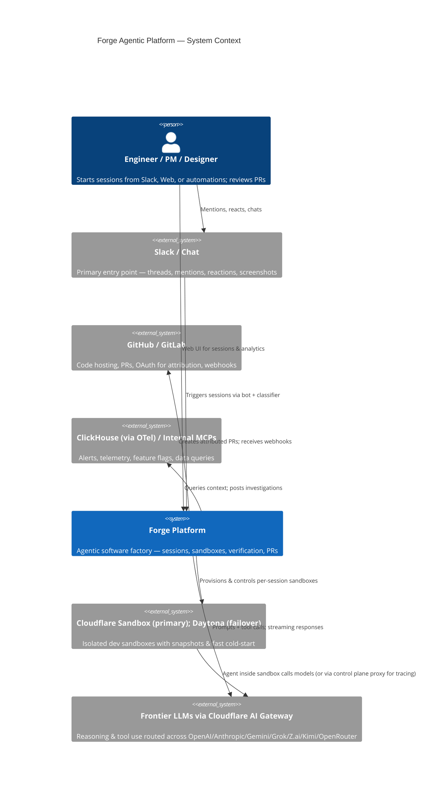
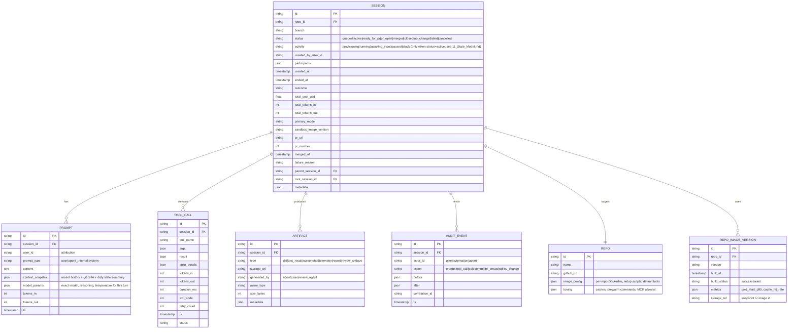

# Forge System Architecture
**Version**: 1.1 (Refined — incorporates Sandboxes V2 learnings, direct WS control, per-repo tuning, cost routing, full tracing)  
**Style**: C4-inspired + layered + dataflow. All diagrams Mermaid (renderable in GitHub, VS Code, Notion, etc.).

## 1. High-Level Context (C4 Level 1)


**Key Insight**: Users interact where they already work (Slack-first). Forge orchestrates trusted sandboxes with full context so agents behave like "the coworker who already knows the codebase".

## 2. Container / Component View (C4 Level 2)
```mermaid
C4Container
    title Forge — Containers & Major Components
    System_Boundary(forge, "Forge Platform") {
        Container(control_plane, "Control Plane", "Cloudflare Workers + Durable Objects (DO) + D1/SQLite", "Session orchestration, real-time WS (Agents SDK), auth, GitHub token brokering, event routing, analytics ingestion. One DO per active session for isolation & state.")
        Container(web_ui, "Web UI", "TanStack Start (React + TypeScript, on CF Workers)", "Dashboard (sessions, analytics), multiplayer presence, hosted VS Code embed (code-server), replay viewer, admin (repo images, automations). Real-time via Agents SDK Client SDK.")
        Container(integration_layer, "Integration Layer", "Slack Bot, GitHub App/Bot, Linear/Notion adapters, Webhook handlers", "Classifiers, event ingestion, bidirectional sync (e.g. PR status → session), automation triggers.")
        Container(analytics, "Analytics & Data Lake", "Session store (sanitized), traces (OTel), aggregated metrics, query service", "Powers insights, cost dashboards, failure analysis, model/tool improvement flywheel. Privacy-preserving.")
        Container(sandbox_orchestrator, "Sandbox Orchestrator", "Dedicated sidecar/service (Worker + scheduled DO or provider cron)", "Owns image build pipeline (GitHub webhook or scheduled), validation, REPO_IMAGE_VERSION updates, snapshot management, warm pool (predictive scaling), provisioning via provider SDK. Clear ownership: Control Plane handles sessions; Orchestrator handles infra/images.")
    }
    Container_Ext(sandbox, "Sandbox (per session)", "Cloudflare Sandbox (primary) / Daytona Devbox (failover via provider interface)", "Full dev env: OpenCode server (agent runtime), rg/git/test runners, company MCPs, code-server + Browser Run + Stagehand for visual verification, pre-warmed caches/services. Ephemeral or snapshot-restored. Credential injection via Outbound Workers boundary.")
    Container_Ext(opencode, "OpenCode", "https://opencode.ai (open-source)", "Server-first AI coding agent inside sandbox. Typed SDK, plugin system for custom tools/MCPs. Handles tool loop, streaming, state.")
    Rel(control_plane, web_ui, "WS streaming, REST/GraphQL for CRUD & commands")
    Rel(control_plane, integration_layer, "Events, triggers, callbacks")
    Rel(control_plane, analytics, "Ingest traces/logs/sessions (sanitized)")
    Rel(control_plane, sandbox_orchestrator, "Control commands (start, prompt, stop, snapshot)")
    Rel(sandbox_orchestrator, sandbox, "Provision/restore image → inject secrets → boot OpenCode")
    Rel(sandbox, opencode, "Runs as primary process; plugins register company tools")
    Rel(opencode, models, "Tool-calling loop with streaming")
    Rel(control_plane, models, "Optional proxy for unified tracing/cost accounting/model router")
```

**Design Rationale (SOTA + Ramp learnings)**:
- **Control Plane on Cloudflare DO + Agents SDK**: Proven by Ramp (recent Sandboxes V2 rewrite) and OSS clone. Direct WebSocket to sandbox (or bridge) eliminates HTTP hop latency/overhead. DO provides per-session SQLite + hibernation (cheap idle). Granularity: session ID.
- **Sandbox Provider**: Cloudflare Sandbox (primary — native integration, Outbound Workers credential boundary, single bill); Daytona via thin provider interface (documented failover). Images rebuilt frequently; snapshots for near-instant restore + recent delta sync. See `08_Tech_Stack.md` §3 and ADR-0001.
- **Agent Runtime**: OpenCode (Ramp recommendation) — server in sandbox, clients anywhere. Plugins for internal tools without forking core. AI-readable source reduces hallucinations on "how do I call X?".
- **Stateless Agent + Stateful Control**: Agent in ephemeral sandbox (fresh or restored); control plane owns durable state, orchestration, attribution.
- **Model Calls & Proxy (resolved post deep-dive)**: OpenCode calls models directly for lowest latency/streaming. Control plane provides optional lightweight instrumentation/sidecar or OTel auto for unified tracing/cost without per-token hop. Router decisions injected at session start.
- **Git Push Auth (resolved, security-first)**: Sandbox does commits with user git identity (secure short-lived injection). Push uses limited-scope deploy key or App token (injected at spawn, short TTL, zeroized). Control plane (user OAuth) only creates the PR. Eliminates token exposure risk.

## 3. Sandbox Lifecycle & Per-Repo Tuning (Critical for UX)
```mermaid
flowchart TD
    A[Repo Change or Scheduled] --> B[Build Pipeline: clone + install deps + run setup scripts + prewarm caches/tests]
    B --> C[Create Filesystem Snapshot + Image Metadata in DO/Dict]
    C --> D{Warm Pool for High-Volume Repos?}
    D -->|Yes| E[Maintain N warm sandboxes from latest snapshot]
    D -->|No| F[On-demand restore from snapshot]
    E --> G[User Prompt Received]
    F --> G
    G --> H[Control Plane: Allocate/Restore Sandbox via Provider SDK + WS handshake]
    H --> I[Inject repo secrets (short TTL) + user git identity + session context]
    I --> J[Boot OpenCode server if not running; load per-repo default tools/MCPs eagerly]
    J --> K[Sync recent changes only (≤30min delta) or full if small repo]
    K --> L[Block writes until sync complete (plugin hook)]
    L --> M[Agent starts reasoning + tool use with rich context]
    M --> N[During session: checkpoints, sub-spawns, real-time stream to control/UI]
    N --> O[Session end or explicit snapshot: capture final FS state for follow-ups]
    O --> P[Optional: archive or prune old snapshots per retention]
```

**Per-Repo Optimizations (Ramp battle-tested)**:
- **Python monolith**: Prewarm mypy incremental cache, test DBs, build caches in image.
- **Infra/Terraform**: `terraform init` at build time.
- **Microservices**: Local stack (docker-compose or equiv) running at boot so agent hits live endpoints immediately.
- **Default tools**: Per-repo MCP allowlist via the registry governance pipeline (`08` §13); lean for some repos, rich for others. Defer heavy tools until task requires.
- **Image freshness & Config Loading**: Rebuild every 30min or on significant change (webhook or scheduled via Orchestrator). Per-repo default tools/MCPs, system prompt fragments, and tuning loaded at boot via mounted config file or OpenCode plugin init (versioned in REPO or REPO_IMAGE_VERSION for safe rollouts/A/B). "Eager load common; defer heavy" enforced by plugin. Delta sync safety: Plugin blocks writes until complete; on failure, session pauses with clear recovery option.

**Sandboxes V2 Pattern (locked)**: Direct WS from the browser → control-plane Worker `/ws/:sessionId` route (auth proxy) → Durable Object, using the **Cloudflare Agents SDK Client SDK** (handles presence + reconnection across browser refreshes). The WS gateway is a *route* on the control-plane Worker, not a separate Worker (see `09_Project_Structure.md` §3 — 2-Worker topology). No in-sandbox HTTP server. Result: time-to-interactive 6.5s → 2s. Fewer moving parts, better traces. See `08_Tech_Stack.md` §7 and ADR-0004.

## 4. Session Data Model & State (Enriched for Analytics, Replay, Audit & Ops)
**Rationale (post deep-dive)**: The original simplified ERD was insufficient for Ramp-style rich dataset needs (800k sessions, 30M tool calls, insights on failures/hallucinations/tool rework), full replay/debugging, compliance audit logs, cost attribution, sub-task lineage, PR linkage, and image versioning. We validated via domain modeling (Python dataclasses experiment confirmed easy extension of SESSION with outcome/cost/pr fields enables key queries like "avg cost per merged PR by repo"). 

**Approach chosen**: Hybrid — extend core entities with high-value fields + add 2-3 supporting entities (AUDIT_EVENT for immutable compliance/replay, REPO_IMAGE_VERSION for ops). Use jsonb flexibly for metadata while keeping queryable scalars. This is at the **Domain Model layer (DDD Aggregate Root = SESSION)** for best maintainability. Avoids over-normalization (MVP velocity) and pure event-sourcing (too heavy initially). Enables all US-5.3 analytics, Security audit requirements, and data flywheel from day one.

**Enriched ERD (Mermaid)**:


**Enabled Capabilities** (directly supports PRD goals, US-5.3, Security audit, cost engineering):
- "Avg LLM spend per successful merged PR by repo/model?"
- "Top tool rework/failure paths + hallucination signals?"
- Full replay: Reconstruct exact agent steps, model thoughts, tool results from PROMPT + TOOL_CALL + AUDIT_EVENT.
- Sub-task lineage via root/parent.
- Image versioning + perf regression detection.
- Immutable audit for compliance/incident response (SOC2-ready).
- Sanitized mirroring to lake still applies; raw in per-DO SQLite for real-time.

State lives primarily in per-session DO (SQLite) for low-latency real-time + durability. Analytics layer mirrors sanitized aggregates/events to **ClickHouse Cloud** (unified observability + analytics lake; see `08_Tech_Stack.md` §4, §14, and ADR-0002). Correlation IDs propagated for full tracing.

## 5. Key Data Flows
### 5.1 Slack → Session Start (Zero-Friction)
1. User posts/replies in thread or reacts with :forge: on message/screenshot.
2. Slack Bot receives event → fast classifier (cheap model + repo catalog) determines target repo or "ask user".
3. Control Plane creates Session record + DO.
4. Sandbox Orchestrator provisions sandbox from latest image/snapshot.
5. OpenCode boots with initial system prompt + thread context + vision (if image) + available tools.
6. First "thinking" streamed back to Slack thread + Web UI.
7. Agent proceeds autonomously or waits for guidance.

### 5.2 Agent Tool Use & Verification Loop (Closed)
Agent (OpenCode) → Tool registry (fs, bash, git, test, MCPs, browser, spawn_subsession, etc.) → Execute in sandbox (safe, audited, scoped to repo) → Result back to model context → Iterate until task complete or human input needed → Propose commit/PR.

Safety: Tool schemas strict; path allowlists; bash with timeout/allowlist + audit log; edits produce reviewable diffs.

### 5.3 Cost & Model Routing Flow (Inspired by Ramp May 2026)
```mermaid
flowchart LR
    Task[Incoming Task: user prompt or automation] --> Classifier{Complexity / Priority Classifier}
    Classifier -->|High (incident, user-facing, complex)| Frontier[Frontier model + high reasoning + fast path]
    Classifier -->|Medium| Balanced[Default-coding tier model (see 08 §6)]
    Classifier -->|Low / Background (recurring checks, summaries)| Flex[Cheaper model or flex tier - slower OK]
    Frontier --> Execute[Sandbox execution with tracing]
    Balanced --> Execute
    Flex --> Execute
    Execute --> Monitor[Post-session: cost, outcome, tokens, duration logged]
    Monitor --> Feedback[Router learns; context hygiene rules updated; tool prefs reinforced]
```

**Context Hygiene & Tool Opts**: Eager-load only common tools/prompts; defer others. Prefer `rg` over `grep` (41% p95 faster). Avoid token compression wrappers that confuse model (RTK lesson). Prune irrelevant history where safe.

### 5.4 PR Creation & Attribution (Safety)
1. Agent finishes → commits on branch (git identity = prompting user via `git config`).
2. Pushes (sandbox has GitHub App or delegated token? Better: control plane handles push/auth? But Ramp uses sandbox push + user token for PR).
3. Control Plane (with user's OAuth token from session start) creates PR via GitHub API.
4. PR body auto-filled with session summary, artifacts links, "Verified in Forge sandbox".
5. Human reviews (with optional Review Agent comments pre-posted).
6. On merge/close: webhook updates session status; analytics capture outcome.

**Why user token for PR?** Attribution, accountability, prevents "bot PRs" bypassing review culture. Branch protection still applies.

## 6. Technology Choices & Justifications

> **All technology choices are resolved and locked in `08_Tech_Stack.md`** — that document is the authoritative spec and supersedes the table below (which is preserved for historical context). Each surprising decision has an ADR in `docs/adr/`.

**Locked (summary — see `08_Tech_Stack.md` for rationale and rejected alternatives):**

| Layer | Locked choice | Detail |
|-------|---------------|--------|
| Control Plane | Cloudflare Workers + Durable Objects + Agents SDK | `08` §2 — global edge, cheap hibernation, per-session state, proven pattern |
| Sandbox | Cloudflare Sandbox (primary) + Daytona (failover interface) | `08` §3, ADR-0001 — Outbound Workers credential boundary; Chainguard base images |
| Agent Harness | OpenCode | `08` §7, ADR-0004 — server-first, MCP-native, programmatically driven |
| Model Abstraction | Cloudflare AI Gateway | `08` §6 — routes to 7 providers, 5-tier routing structure |
| Frontend | TanStack Start + shadcn/ui + Tailwind v4 + Tremor | `08` §8, ADR-0003 — type-safe full-stack on CF Workers |
| Auth | Cloudflare Access → Google Workspace; GitHub App + per-user OAuth | `08` §10 |
| Observability | ClickHouse Cloud + ClickStack + Grafana | `08` §14, ADR-0002 — unifies traces/metrics/logs/analytics; Tempo/Loki/Prometheus dropped |
| Audit | R2 Object Lock + Merkle chain → Rekor + Pipelines → ClickHouse | `08` §5, ADR-0005 — Rekor is the single trust anchor |
| Data / Analytics | DO SQLite + D1 + R2 + KV + Vectorize + ClickHouse | `08` §4 — DO is source of truth; others one-way derived |
| MCP / Artifacts | Federate MCP Registry; OCI in GHCR via KitOps; D1 policy | `08` §13, ADR-0007 — unified pipeline for MCP servers + sandbox images |
| Integrations | Slack Bolt on CF Worker; GitHub App | `08` §11 |
| Cost Control | DO counters + AI Gateway + ClickHouse alerts + KV kill-switch | `08` §17 |
| Toolchain | pnpm + TS 7-native + Oxlint + Oxfmt + Vitest + Playwright | `08` §9, ADR-0006 |
| IaC / CI/CD / Secrets | Pulumi + GitHub Actions + CF Workers Builds + CF Secrets Store | `08` §16 |
| Supply Chain | Dependabot + GHAS + Chainguard + Trivy/Syft + Sigstore + Scorecard | `08` §15 |

## 7. Scaling, Reliability & Multiplayer Considerations
- **Concurrency**: Hundreds of parallel sessions supported (Ramp scaled to 10k+/day). DOs + provider sandboxes horizontal.
- **Multiplayer**: Shared DO state or optimistic sync + conflict resolution on edits (git is source of truth). Presence via WS broadcast.
- **Resilience**: Circuit breakers on model/providers; fallback models; session checkpointing in DO; replay from trace on failure.
- **Cold Start Mitigation**: Warm pools for top repos; proactive warming on prompt queue; image pre-pulls.
- **Data Residency**: If required, self-hosted sandbox provider + regional CF or equiv.

## 8. Evolution Path (Agentic Factory)
MVP: Coding agent with verification + Slack/Web + PRs.  
v1: Automations (alert→investigate→PR), Review Agents.  
v2: Broader context (team ownership, project knowledge from Notion/Linear), self-improving via data, cross-repo orchestration, "never touch GitHub" teaser (full in-platform review/merge with human gates?).

This architecture directly addresses Ramp's production learnings (perf via direct WS, per-repo obsession, cost routing, data flywheel) while being implementable via OSS accelerator + company-specific customization.

*Diagrams portable. For interactive C4, export to Structurizr or use Mermaid live editor.*